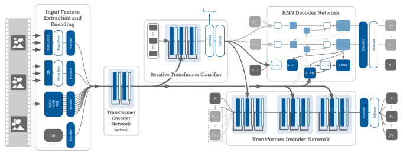

<h1 align='center'>Attributes and SVOs for Video Captioning</h1>


<p align="center"></p>

This implementation is based on ["Syntax-Aware Action Targeting for Video Captioning"](http://openaccess.thecvf.com/content_CVPR_2020/papers/Zheng_Syntax-Aware_Action_Targeting_for_Video_Captioning_CVPR_2020_paper.pdf) ([code](https://github.com/SydCaption/SAAT)) which is based on ["Consensus-based Sequence Training for Video Captioning"](https://github.com/mynlp/cst_captioning).

## Dependencies

* Python 3.6
* PyTorch 1.1
* CUDA 10.0

This repo includes an [edited version (`coco-caption`)](coco-caption) of the [Python 3 coco evaluation protocols](https://github.com/salaniz/pycocoevalcap) (edited to load CIDEr corpus)

## Data
The datasets and their features can be downloaded from my **Google Drive** along with pre-trained models resultant from the experiments:
* [`datasets/msrvtt`](https://drive.google.com/drive/folders/1qYfGVEOj7qwp-DvsEHq0vhyld00MF1Ii?usp=sharing)
* [`datasets/msvd`](https://drive.google.com/drive/folders/1IIt4cBfzyvTF6t2cCqWPjay3VrVQh00J?usp=sharing)
* [`experiments`](https://drive.google.com/drive/folders/1qthoGUZTdYR_sONMOmycw97TBC6X_zf5?usp=sharing)

## Experiments
[View my experiments and results](experiments)


## Train
To train on MSVD:
```bash
python train.py --dataset msvd 
                --captioner_type lstm 
                --model_id lstm_1 
                --batch_size 8 
                --test_batch_size 8 
                --max_epochs 100
```

To train on MSR-VTT:
```bash
python train.py --dataset msrvtt 
                --captioner_type lstm 
                --model_id lstm_1  
                --batch_size 8 
                --test_batch_size 4 
                --max_epochs 200
```

## Test / Evaluate
Testing occurs automatically at the end of training, if you would like to run separately use [`evaluate.py`](evaluate.py)
To evaluate on MSVD:
```bash
python evaluate.py --dataset msvd 
                   --captioner_type lstm 
                   --model_id lstm_1 
                   --test_batch_size 8 
```

To evaluate on MSR-VTT:
```bash
python evaluate.py --dataset msrvtt 
                   --captioner_type lstm 
                   --model_id lstm_1  
                   --test_batch_size 4 
```


### Acknowledgements

* PyTorch implementation of [SAAT](https://github.com/SydCaption/SAAT)
* PyTorch implementation of [CST](https://github.com/mynlp/cst_captioning)
* PyTorch implementation of  [SCST](https://github.com/ruotianluo/self-critical.pytorch)
